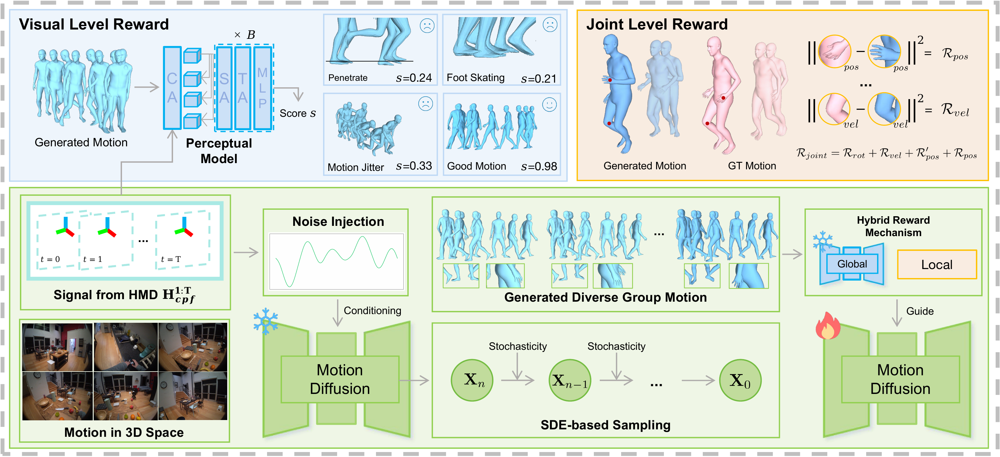

<div align="center">

# 🎯 MotionGRPO

**Overcoming Low Intra-Group Diversity in GRPO-Based Egocentric Motion Recovery**

[](https://icml.cc/)
[](https://arxiv.org/abs/2605.05680)
[](https://3dagentworld.github.io/MotionGRPO)
[](https://github.com/3DAgentWorld/MotionGRPO)

[Nanjie Yao](https://jackiemin233.github.io/Jackiemin233/) · Junlong Ren · [Wenhao Shen](https://shenwenhao01.github.io) · [Hao Wang](mailto:haowang@hkust-gz.edu.cn)

**The Hong Kong University of Science and Technology (Guangzhou)** · **Nanyang Technological University**

</div>

---

## 📰 News

- **[2026-07]** 🎉 MotionGRPO has been accepted to **ICML 2026**!
- **[2026-05]** 📄 Preprint available on [arXiv](https://arxiv.org/abs/2605.05680).
- **🔜 [2026-07]** We are actively extending this work to **hand motion recovery**. The enhanced codebase and the extended preprint will be released in **October 2026**. Stay tuned!

---

## 📝 Abstract

Recovering full-body 3D human motion from head-mounted device signals remains a critical challenge for VR/AR applications. Existing diffusion-based methods often rely on global distribution matching, leading to local joint reconstruction errors and visual artifacts such as foot skating and ground penetration.

**MotionGRPO** addresses these issues by leveraging **Reinforcement Learning (RL) post-training** to inject fine-grained guidance into the diffusion process. We model diffusion sampling as a Markov Decision Process (MDP) and optimize it via **Group Relative Policy Optimization (GRPO)** with a hybrid reward mechanism. A trajectory-conditioned perceptual model ensures global visual plausibility, while explicit sub-rewards target joint positions, rotations, and velocities for local precision. To overcome the **low intra-group diversity** bottleneck that causes vanishing gradients in GRPO, we introduce a temporally smoothed noise-injection strategy that increases output variance and stabilizes training.

Extensive experiments on **AMASS** and **RICH** benchmarks demonstrate that MotionGRPO achieves **state-of-the-art performance** with superior visual fidelity.

---

## 🔗 Links

- 🏠 **Project Page:** [https://3dagentworld.github.io/MotionGRPO](https://3dagentworld.github.io/MotionGRPO)
- 📄 **arXiv:** [https://arxiv.org/abs/2605.05680](https://arxiv.org/abs/2605.05680)
- 💻 **Code:** Coming soon — the official implementation and an enhanced version (with hand recovery extension) are expected to be released in **October 2026**.

---

## 🏗️ Method Overview

<div align="center">
  
  <p><em>MotionGRPO formulates diffusion sampling as an MDP and optimizes it via GRPO with a hybrid reward mechanism.</em></p>
</div>

### Key Contributions

1. **RL-Based Motion Recovery Framework** — We propose MotionGRPO, which optimizes a hybrid reward combining a trajectory-conditioned perceptual model for global plausibility and fine-grained objectives for precise joint alignment.

2. **Noise-Injection Strategy** — We identify the low intra-group diversity bottleneck in GRPO and introduce temporally smoothed noise injection to increase output diversity and stabilize training.

3. **State-of-the-Art Performance** — Extensive experiments on AMASS and RICH benchmarks show that MotionGRPO achieves superior visual fidelity and strong generalization to real-world scenarios.

---

## 📊 Results

MotionGRPO achieves **state-of-the-art results** on both AMASS and RICH benchmarks across joint accuracy and visual quality metrics.

| Method | AMASS MPJPE ↓ | AMASS PA-MPJPE ↓ | RICH MPJPE ↓ | RICH PA-MPJPE ↓ |
|--------|--------------|------------------|--------------|-----------------|
| EgoEgo | 177.231 | 152.125 | 221.450 | 196.223 |
| EgoAllo | 124.985 | 103.958 | 192.686 | 172.724 |
| **MotionGRPO** | **114.207** | **95.512** | **187.223** | **169.146** |

See the paper and [project page](https://3dagentworld.github.io/MotionGRPO) for the full quantitative and qualitative results.

---

## 📖 Citation

If you find this work useful, please cite:

```bibtex
@inproceedings{
yao2026motiongrpo,
title={Motion{GRPO}: Overcoming Low Intra-Group Diversity in {GRPO}-Based Egocentric Motion Recovery},
author={Nanjie Yao and Junlong Ren and Wenhao Shen and Hao Wang},
booktitle={Forty-third International Conference on Machine Learning},
year={2026},
}
```

---

## 📧 Contact

For questions or collaborations, please contact [Hao Wang](mailto:haowang@hkust-gz.edu.cn) or open an issue.

---

<div align="center">
  <sub>Built with ❤️ by the 3DAgentWorld team.</sub>
</div>
